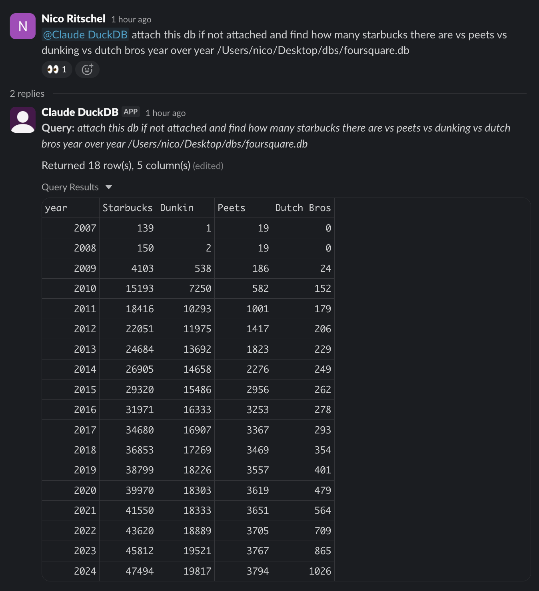

# duckdb-claude-slack

Slack bot that queries Claude Code via the [DuckDB ACP extension](https://github.com/sidequery/duckdb-acp).

The ACP extension wraps Claude Code, giving it access to a DuckDB instance (read-only: no write, update, or delete capabilities) with NO access to the local filesystem or bash shell.

Let anyone on your team interrogate data in plain English, not just "data people." Ask a question in Slack, get results back as a CSV.



## Install

```bash
uvx duckdb-claude-slack
```

## Setup

1. Create a Slack app using the manifest in `slack_manifest.json`
2. Enable Socket Mode and generate an app token (`xapp-...`)
3. Install to workspace and copy the bot token (`xoxb-...`)
4. Set `SLACK_BOT_TOKEN` and `SLACK_APP_TOKEN` (supports dotenv)
5. Run `duckdb-claude-slack`

## CLI Options

```
--bot-token    Slack Bot Token (xoxb-...)  [env: SLACK_BOT_TOKEN]
--app-token    Slack App Token (xapp-...)  [env: SLACK_APP_TOKEN]
--db           Database file to attach
--db-name      Name for attached database (default: filename)
--init-sql     Path to SQL file to run on startup
```

Auto-loads `.env` and `.env.local` from current directory.

### Examples

Attach a database:

```bash
duckdb-claude-slack --db /path/to/sales.duckdb
```

With custom name:

```bash
duckdb-claude-slack --db /path/to/data.duckdb --db-name mydata
```

Run init SQL on startup (install extensions, attach remote DBs, etc.):

```bash
duckdb-claude-slack --init-sql init.sql
```

## Usage

Mention the bot in Slack:

```
@Claude DuckDB show me the top 10 customers by revenue
```

Results are returned as a CSV attachment.
